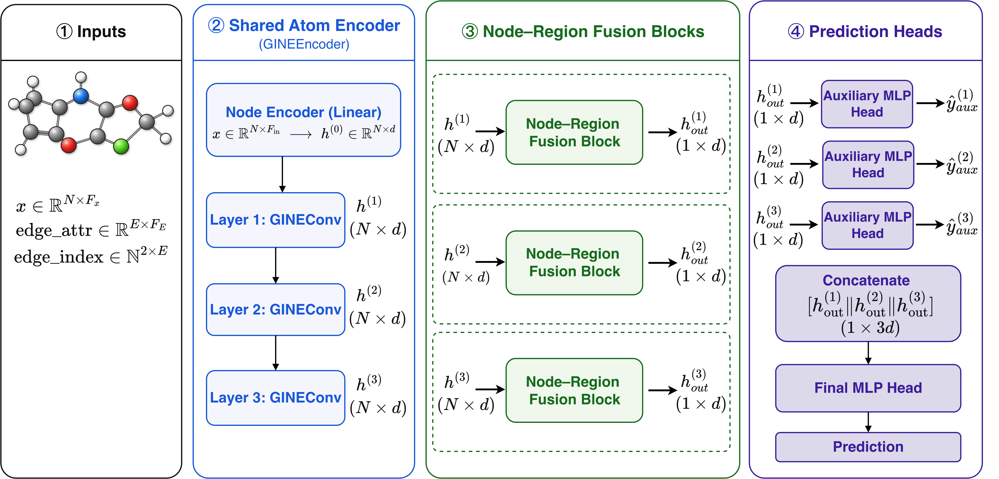
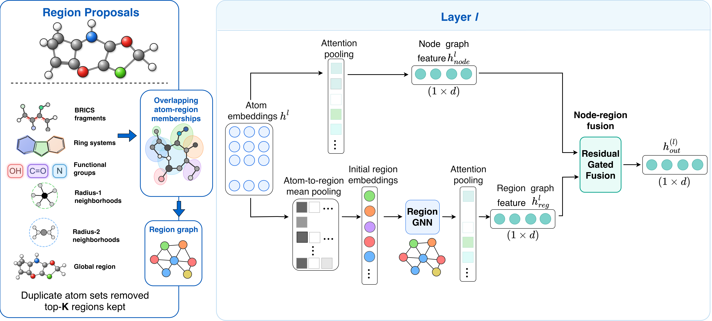

# HNMF-Net

HNMF-Net is a hierarchical molecular graph neural network for molecular
property prediction. It reconstructs overlapping molecular regions from
atom embeddings at successive GINE depths and integrates atom- and
region-level representations through residual gated fusion.

## Model Overview

<p align="center">
  
</p>

<p align="center">
  <em>Overview of the HNMF-Net architecture.</em>
</p>

<p align="center">
  
</p>

<p align="center">
  <em>Overview of the HNMF-Net region reconstruction.</em>
</p>

## Dataset
All data in dataset directory, which already are refined. 


## How to use
```bash
python main.py
```
Could train and test on all datasets. Because the size of region cache files exceed the github limit, So I uploaded all cache files in google driver: https://drive.google.com/drive/folders/1uzg3cEXMxzokM40xTG5v51wUFl8WZBtP?usp=sharing
